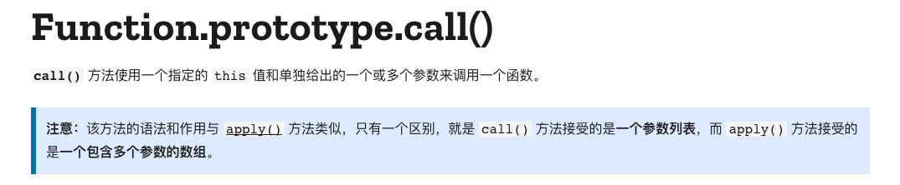

---
nav:
  title: 手写call
  order: 2
---

# 手写call




```javascript
Function.prototype.myCall = function(context, ...args) {
  if (!context || context === null) {
    context = window; // 判断有没有传第一值作为新的this指向，如果没有则设为window
  }
  const fn = Symbol(); // 保存出来一个独一无二的值，作为新方法的名字，以防覆盖已有方法的名字，也便于后续删除
  context[fn] = this; // 给新的this指向附上需要call的方法，这个时候this就是之前的方法
  const res = context[fn](...args); // 传参，执行，获取返回值
  delete context[fn]; // 删除给this新增的方法
  return res // 返回方法执行后的结果
}

const a = {
  name: '孙悟空',
  print: function() {
    console.log(this.name)
  }
}
a.print() // 孙悟空

const b = { name: '孙悟天' }
a.print.call(b) // 孙悟天
a.print.myCall(b) // 孙悟天

```